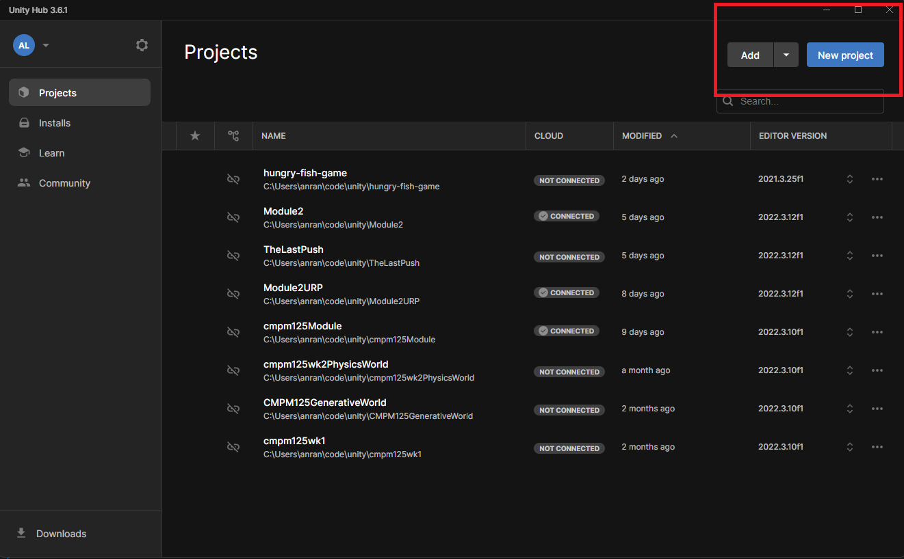
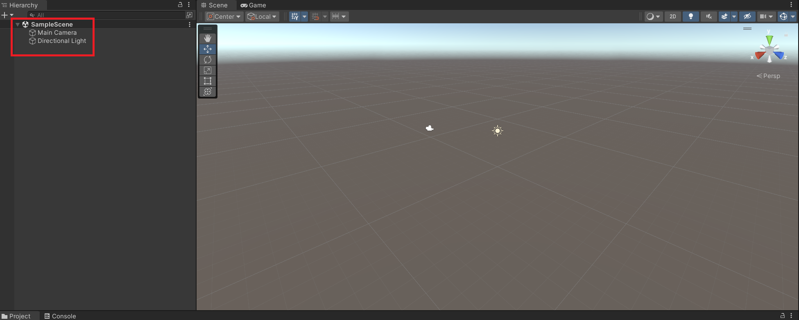
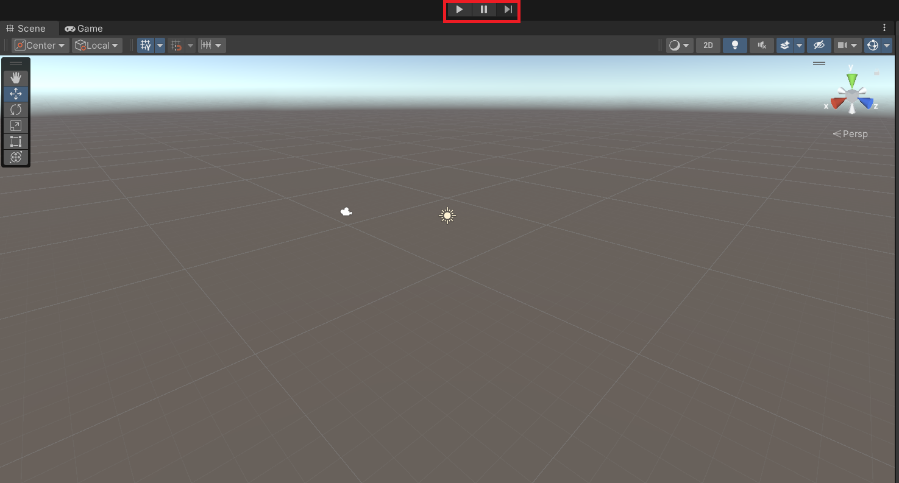
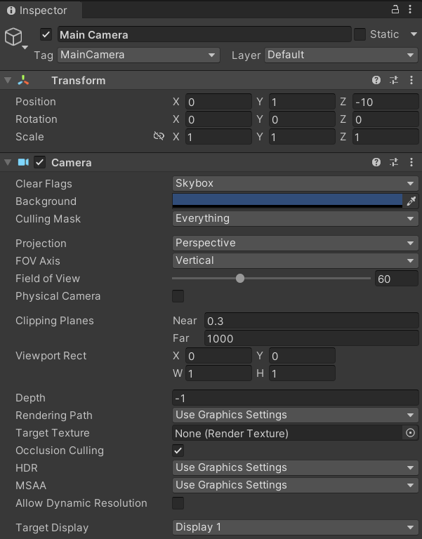
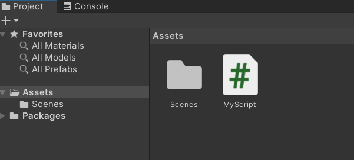
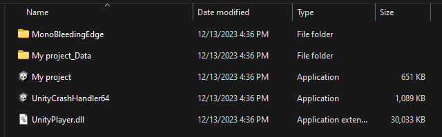

# Your First Unity Project
### Introduction
This tutorial is designed to guide you through how to get your feet wet with the Unity engine and its editor. 

Prerequisites
Unity 2022.x
Basic understanding of any C like programming language.

## Getting Started
Open up Unity Hub and click on New Project

You can pick any template you like, but I recommend 3D, as that is the most popular Unity experience.

## Unity Editor
After a short (or sometimes long) wait, we have arrived at the Unity Editor. 
The most important things to know here are 
1) The object Hierarchy 

Here lies all the game objects that are in your game. Notice that you start with a Main Camera and a light source
if you are using the 3D template. 
 

2) The play button 

This play button allows you to test play the game before you actually package it up into a game that can be played on its own.
 
<strong>Note: edits you make while in play mode are not saved!</strong>

 

3) The inspector  

 
Here, you can manipulate the properties of your game objects when you select them.

4) Scripting  

 
Because I mentioned some basic coding as a prerequisite, I am just going to show you <em>where</em> to code.  
Right click and create a new script in the Project tab below, and double click it. It will open the script in your editor (Visual Studio) by default, 
and you can start writing code. To attach it to any game object, simply drag it into the inspector with that game object selected. 
 

### General Tips
The Unity editor, although beginner friendly, is complicated, and updates are always coming out. 
The good news is that there is a wealth of resources that explain everything in a lot of detail, including a ton of official documentation 
<a href="https://docs.unity.com/">here</a>
.
 
I won't go into specific steps, since I don't want to stifle your creative direction, but some general tips are to have fun, and start small. There are infinite directions you can go into, and you are really only limited by your imagination. 

## Building
Click File > Build Settings, and this will open up a menu. Depending on what operating system you are using, what you could be seeing could be different. But Unity generally does a pretty robust job at building any game that does not have existing errors. Remember to have all the scenes you want in your game in this build hierarchy, and click Build. Select a folder that is <strong>NOT</strong> your project folder, and an executable will be made there. 

 
Here, my game is "My project", and running it will be like any other game that you would play. 
## Conclusion
And there you have it! Your first Unity game, with a build version. 
Happy game making!

### Recommended next topics for further exploration
- Physics
- Trigger Volumes
- Camera Controls
- Terrain Generation

## Acknowledgements
Most of my knowledge was gained during CMPM 123 - Game Technologies at UCSC. 